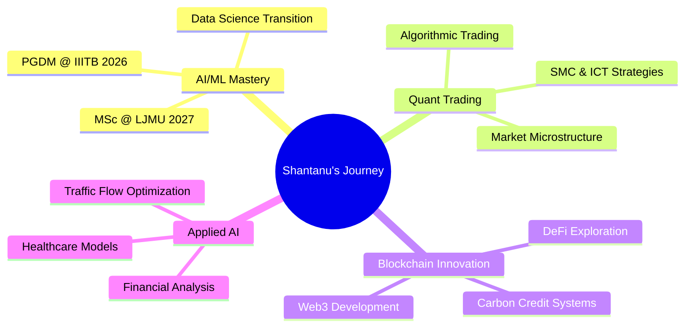

<div align="center">

# Hey there! I'm Shantanu Vichare 👋

### 🚀 Lead QA Engineer | 🤖 AI/ML Enthusiast | ⛓️ Blockchain Builder | 📈 Quant Trading Explorer

[](https://www.linkedin.com/in/shantanuvr/)
[](https://github.com/ShantanuVr)
[](https://www.quickheal.com/blogs/?s=Shantanu+Vichare)
[](http://www.shantanuvr.com)


</div>

---

## 🎯 About Me

> **"Breaking software to make it unbreakable, automating everything to innovate faster."**

I'm a **Lead QA Engineer** with **10.5+ years** of experience transforming how teams approach quality. My journey spans from **malware research trenches** at Quick Heal to **building enterprise-grade test automation ecosystems** at Powerschool.

🔥 **What makes me different?**
- 🤖 **Early AI Adopter** - Pioneering Agentic AI integration in SDLC since ChatGPT's launch
- 🏗️ **Framework Architect** - Built 4+ automation frameworks (Codeception, WDIO, Playwright, Robot)
- 🔐 **Security DNA** - 3 years of malware analysis & vulnerability testing experience
- ⛓️ **Blockchain Builder** - Creating carbon credit systems with Solidity & Web3
- 📊 **Quant Curious** - Developing trading algorithms with SMC & ICT concepts

---

## 🎓 Education & Learning

| 🎓 Degree | 🏛️ Institution | 📅 Year |
|-----------|----------------|---------|
| **M.Sc. Machine Learning & AI** | Liverpool John Moores University | 🔜 2027 |
| **Executive PGDM ML & AI** | IIIT Bangalore | 🔜 2026 |
| **B.E. Information Technology** | Mumbai University | ✅ 2015 |

---

## 💼 Professional Journey

```
┌─────────────────────────────────────────────────────────────────────────────────────┐
│  2023 - Present  │  🚀 Lead QA Engineer     │  Powerschool                          │
│  2020 - 2023     │  🔧 Sr. QA Engineer II   │  Powerschool                          │
│  2018 - 2020     │  🧪 SDET                 │  FireEye Cybersecurity                │
│  2015 - 2018     │  🔬 Threat Researcher    │  Quick Heal Technologies              │
└─────────────────────────────────────────────────────────────────────────────────────┘
```

### 🏆 Key Achievements

<table>
<tr>
<td width="50%">

**🎯 At Powerschool**
- 📈 Led QA for **Schoology** with 1600+ automated scenarios
- 🤖 Pioneered **Agentic AI** adoption in SDLC
- 🛠️ Built **3 automation frameworks** from scratch
- ⏱️ Saved **40+ hours/week** with release automation tools
- 👨‍🏫 Trained teams on AI-driven testing approaches

</td>
<td width="50%">

**🔥 At FireEye**
- 🔒 Performed **vulnerability testing** for all product releases
- 🏗️ Built **E2E test frameworks** for security products
- 🚦 Was part of **Go/No-Go** release decision team
- 🔄 Managed **CI/CD pipelines** on Jenkins

</td>
</tr>
<tr>
<td width="50%">

**🛡️ At Quick Heal**
- 🔬 Researched & classified **malware threats**
- ✍️ Published **security blogs** read by thousands
- ⚙️ Automated processes saving **50+ hours/week**
- 🎯 Handled **enterprise client escalations**

</td>
<td width="50%">

**🚀 Innovation Highlights**
- 🧠 Built AI-assisted Playwright automation
- 📊 Created decision trace Context Graphs for Agents
- 🔄 Developed Record & Play test converters
- 🤖 Integrated GitHub Copilot as code reviewer

</td>
</tr>
</table>

---

## 🛠️ Tech Arsenal

<div align="center">

### Languages & Frameworks


### Testing & Automation


### AI & ML


### DevOps & Tools


### Blockchain & Web3


</div>

---

## 🌟 Featured Projects

<div align="center">

### 🌱 Carbon Credit Blockchain Ecosystem
*A comprehensive suite for carbon credit tokenization, trading & verification*

</div>

| Repository | Description | Tech |
|------------|-------------|------|
| [🏭 carbon-credit-token-suite](https://github.com/ShantanuVr/carbon-credit-token-suite) | ERC-1155 carbon credit tokens with role-based access | Solidity, Foundry |
| [🔗 registry-adapter-api](https://github.com/ShantanuVr/registry-adapter-api) | REST API adapter between Official Registry & Chain | TypeScript, JWT |
| [☀️ iot-solar-sim](https://github.com/ShantanuVr/iot-solar-sim) | IoT Solar Plant Simulator with blockchain anchoring | TypeScript, Fastify, Prisma |
| [🔐 evidence-locker](https://github.com/ShantanuVr/evidence-locker) | Content-addressed evidence storage for carbon verification | TypeScript, IPFS, S3 |
| [🛒 carbon-credit-buyer-marketplace](https://github.com/ShantanuVr/carbon-credit-buyer-marketplace) | Demo marketplace for carbon credit trading | Next.js 15, TypeScript |
| [🔍 carbon-explorer](https://github.com/ShantanuVr/carbon-explorer) | Public explorer for the Carbon Credit system | TypeScript, React |

<div align="center">

### 📈 Trading & Financial Analysis

</div>

| Repository | Description | Tech |
|------------|-------------|------|
| [📊 OHLC_ANALYZER](https://github.com/ShantanuVr/OHLC_ANALYZER) | No-Code Backtesting Platform with Smart Money Concepts | Python |
| [💹 Advisor](https://github.com/ShantanuVr/Advisor) | Personal Trading Advisor for XAUUSD & EURUSD | Python |

---

## 📊 GitHub Stats

<div align="center">

<!-- GitHub Activity Graph - This one works! -->


<br/>

<!-- GitHub Profile Summary Cards - Alternative that's more reliable -->


</div>

---

## 🎯 Current Focus & Aspirations



### 🌱 Building Towards
- 🏥 **Healthcare AI** - Models for small clinics & diagnostics
- 🚗 **Traffic Optimization** - ML for flow management
- 💰 **Quant Trading** - SMC, ICT & Technical Analysis models
- 🌍 **Carbon Markets** - Blockchain-based credit verification

---

## 🤝 Let's Connect!

<div align="center">

**I'm always excited to collaborate on:**

🤖 AI-driven automation & testing tools · ⛓️ Blockchain & Web3 projects

📈 Trading algorithms & financial analysis · 🌱 Sustainability & carbon credit systems

<br/>

[](mailto:vichare.shantanu@gmail.com)
[](https://www.linkedin.com/in/shantanuvr/)
[](https://twitter.com/ShantanuVr)

---


*"Quality is not an act, it's a habit." - Aristotle*

</div>
